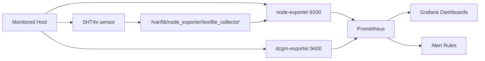

Site Monitoring — Prometheus, Grafana, and SHT4x exporter

Summary
-
This folder provides a compact, reusable site monitoring template: a per-host exporter bundle that publishes host and SHT4x temperature sensor metrics, and a central Prometheus + Grafana stack with sample dashboards and alerts.

Structure
-
- `prometheus_exporter/` — per-host exporter components:
	- `sht4x_to_prom.py` — Python serial reader that writes Prometheus textfile metrics for SHT4x sensors.
	- `docker-compose.yml` — runs the reader, `prom/node-exporter`, and optional `nvidia/dcgm-exporter`.
	- `counters.csv` — DCGM metric selection for GPU monitoring.

- `prometheus+grafana/` — central monitoring stack:
	- `docker-compose.yml` — runs Prometheus and Grafana.
	- `prometheus.yml` — scrape targets (edit to match your site).
	- `grafana_configs/` — exported dashboards and alert definitions.

How it works
-
- The serial reader listens on a serial device (default `/dev/trinkey`) and writes a `.prom` file into node_exporter's textfile collector directory (`/var/lib/node_exporter/textfile_collector`). The file exposes two metrics:
  - `sht4x_temperature_celsius{host="<hostname>"}`
  - `sht4x_humidity_percent{host="<hostname>"}`
- `node_exporter` exposes host metrics on port `9100` and reads the textfile collector directory to pick up custom `.prom` files.
- dcgm-exporter exposes GPU metrics on port `9400` (optional).
- Prometheus scrapes the exporters; Grafana visualizes dashboards and evaluates alerts.

Architecture diagram
-


Quick start
-
Per host (exporter):

```bash
cd site-monitoring/prometheus_exporter
sudo docker build --network=host -t trinkey-reader -f Dockerfile.trinkey .
sudo docker compose up -d
```

Central (Prometheus + Grafana):

```bash
cd site-monitoring/prometheus+grafana
sudo docker compose up -d
```

Configuration notes
-
- Edit `prometheus+grafana/prometheus.yml` to add your node IPs and ports. The sample file contains static IPs used at AERPAW.
- Change the serial device by setting the `DEVICE` environment variable in `prometheus_exporter/docker-compose.yml`.
- Grafana dashboards and alerts live in `prometheus+grafana/grafana_configs/` and can be imported via Grafana's UI or provisioned.

Device data format
-
The serial reader expects comma-separated lines where the 2nd field is temperature (°C) and the 3rd is humidity (%). Example:

```
SENSORID,23.5,45.2
```

Troubleshooting
-
- If the serial reader cannot open the device: verify host permissions and container device mapping; map the correct host device into the container.
- If Prometheus shows `up` = 0 for a target: confirm the target is reachable and the port is correct in `prometheus.yml`.
- For dcgm-exporter issues: ensure NVIDIA drivers and GPU device access are available on the host.

